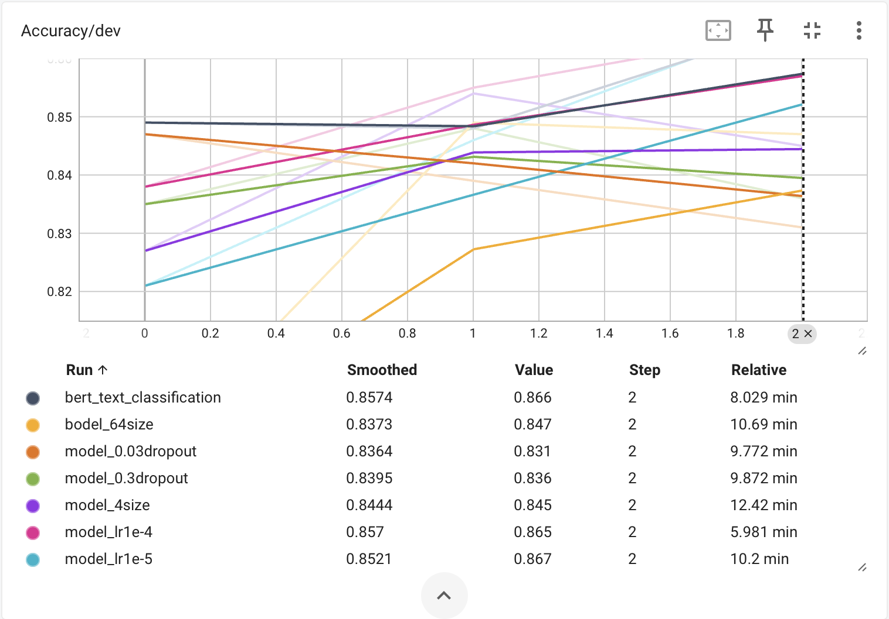
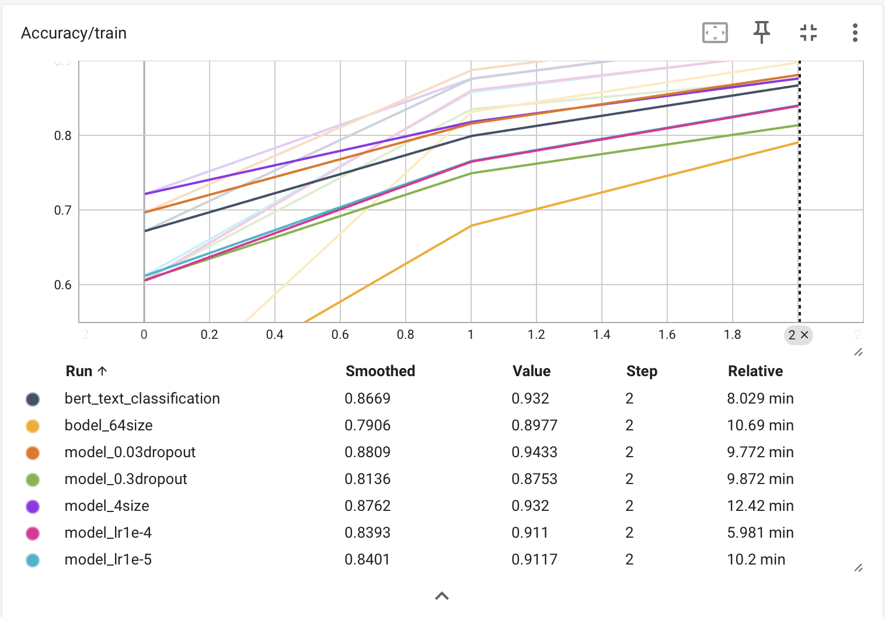
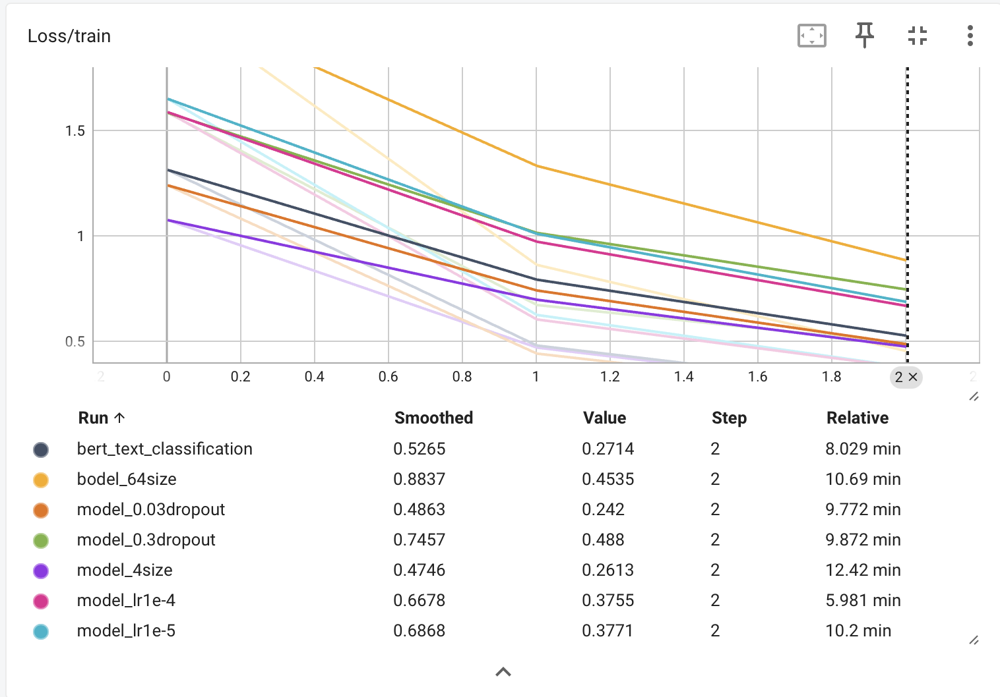

# Demo 1 · 基于 BERT 的中文新闻文本分类

用 `bert-base-chinese` 对今日头条新闻做 **15 类文本分类**，并以控制变量法对比
**Learning Rate / Batch Size / Hidden Dropout** 三组超参数对训练过程与验证集表现的影响。



- 任务：中文新闻标题分类（今日头条数据集，15 类）
- 模型：`bert-base-chinese` + 线性分类头
- 框架：PyTorch（数据读取、Dataset/DataLoader、训练循环、指标统计全部手写）
- 可视化：`torch.utils.tensorboard.SummaryWriter`（TensorBoard）
- 基线结果：**Dev Accuracy 86.6%，Train Accuracy 93.2%，测试集准确率通过 83% 参考指标**

> 题目原本建议用 SwanLab 可视化。本项目改用 PyTorch 自带的 `SummaryWriter` + TensorBoard
> 完成"训练过程与结果可视化"，未使用 `transformers.Trainer`、`datasets`、`scikit-learn`、
> `matplotlib` 或 SwanLab。

## 目录结构

```text
0.demo1文本分类/
├── README.md                    # 本文件
├── requirements.txt             # 依赖
├── .gitignore
├── data/                        # 数据集
│   ├── train_3k.txt             # 训练集 3000 条
│   ├── dev_1k.txt               # 验证集 1000 条
│   ├── test_1k.txt              # 测试集 1064 条
│   └── README.md                # 数据格式与字段说明
├── src/                         # 源码
│   ├── train.py                 # 基线训练脚本（其余实验脚本都由它派生）
│   ├── test.py                  # 载入 checkpoint，在测试集上评估
│   └── experiments/             # 6 组控制变量实验脚本
│       ├── exp_lr_1e-5.py
│       ├── exp_lr_1e-4.py
│       ├── exp_batch_4.py
│       ├── exp_batch_64.py
│       ├── exp_dropout_0.03.py
│       ├── exp_dropout_0.3.py
│       └── README.md            # 实验设计与运行方式
├── scripts/
│   └── run_experiments.sh       # 一键依次跑完 6 组实验
├── checkpoints/                 # 权重文件（约 8.5 GB，已 gitignore）
│   └── README.md
├── runs/                        # TensorBoard 日志（已 gitignore）
├── results/                     # 实验图表（入库，供报告引用）
│   ├── figures/                 # 报告用的对比曲线
│   ├── screenshots/             # 单实验 TensorBoard 截图
│   └── README.md
└── docs/
    ├── BERT中文文本分类与超参数实验报告_草稿.docx
    └── 任务要求.png              # 课程题目原文截图
```

图片、权重、日志与代码彼此分离；权重和 TensorBoard 日志体积大，用 `.gitignore` 排除，
仓库只保留**可复现的源码、数据、图表和文档**。

## 环境准备

```bash
conda activate learn-pytorch     # 或自行准备 Python 3.10+ 环境
pip install -r requirements.txt
```

实测环境：Python 3.13.14 / torch 2.12.1 / transformers 5.12.1，Apple Silicon（MPS 可用）。

脚本内部用 `local_files_only=True` 加载 `bert-base-chinese`，所以**首次使用前需要先把模型下载到本地缓存**：

```bash
python -c "from transformers import AutoTokenizer, AutoModelForSequenceClassification; \
AutoTokenizer.from_pretrained('bert-base-chinese'); \
AutoModelForSequenceClassification.from_pretrained('bert-base-chinese')"
```

## 快速开始

所有命令都在项目根目录执行（脚本内部按 `__file__` 定位路径，不依赖当前工作目录）。

```bash
# 1. 基线训练（lr=2e-5, batch_size=16, hidden_dropout=0.1，3 个 epoch）
python src/train.py

# 2. 用最优 checkpoint 在测试集上评估
python src/test.py

# 3. 查看训练曲线
tensorboard --logdir runs      # 浏览器打开 http://localhost:6006

# 4. 依次跑完 6 组超参数对照实验（耗时较长，每组约 6~12 分钟）
bash scripts/run_experiments.sh
```

每次运行都会：

1. 读取 `data/` 下三份数据，从标签集合建立 15 类的 `label2id / id2label`；
2. 构造 PyTorch `Dataset / DataLoader`；
3. 微调 `bert-base-chinese`，每个 epoch 在验证集上评估；
4. 把 `Loss/train`、`Accuracy/train`、`Accuracy/dev` 写入 `runs/<实验名>/`；
5. 按 **dev accuracy 最优**保存 checkpoint 到 `checkpoints/`。

## 基线配置

| 项目 | 设置 |
| --- | --- |
| 预训练模型 | `bert-base-chinese` |
| 类别数 | 15 |
| `max_length` | 128 |
| 输入 | `title + " " + keywords` |
| 损失函数 | `CrossEntropyLoss` |
| 优化器 | `AdamW` |
| Epoch | 3 |
| Learning Rate | 2e-5 |
| Batch Size | 16 |
| Hidden Dropout | 0.1 |
| Attention / Classifier Dropout | 保持 0.1 |
| 设备 | 优先 MPS，否则 CPU |
| 模型选择 | 按 dev accuracy 保存最优 |

模型结构：`bert-base-chinese` → `[CLS]` 隐状态 → Dropout → `Linear(768, 15)`。

## 实验结果

### 实验矩阵（控制变量法）

| 实验组 | Learning Rate | Batch Size | Hidden Dropout |
| --- | --- | --- | --- |
| Baseline | 2e-5 | 16 | 0.1 |
| LR-1 | 1e-5 | 16 | 0.1 |
| LR-2 | 1e-4 | 16 | 0.1 |
| BS-1 | 2e-5 | 4 | 0.1 |
| BS-2 | 2e-5 | 64 | 0.1 |
| Dropout-1 | 2e-5 | 16 | 0.03 |
| Dropout-2 | 2e-5 | 16 | 0.3 |

### 第 3 个 Epoch 的结果

TensorBoard 中 `Step = 0/1/2` 分别对应第 1/2/3 个 epoch，下表取 `Step = 2` 的**原始 Value**
（不是平滑后的 Smoothed 数值）。

| 实验 | 改变参数 | Train Acc | Train Loss | Dev Acc |
| --- | --- | --- | --- | --- |
| **Baseline** | 默认 | 93.20% | 0.2714 | **86.60%** |
| LR=1e-5 | `lr=1e-5` | 91.17% | 0.3771 | **86.70%** |
| LR=1e-4 | `lr=1e-4` | 91.10% | 0.3755 | 86.50% |
| Batch Size=4 | `batch_size=4` | 93.20% | 0.2613 | 84.50% |
| Batch Size=64 | `batch_size=64` | 89.77% | 0.4535 | 84.70% |
| Dropout=0.03 | `hidden_dropout=0.03` | 94.33% | 0.2420 | 83.10% |
| Dropout=0.3 | `hidden_dropout=0.3` | 87.53% | 0.4880 | 83.60% |

### 曲线

| 验证集准确率 | 训练集准确率 | 训练损失 |
| --- | --- | --- |
|  |  |  |

### 结论摘要

- **Learning Rate**：1e-5 / 2e-5 / 1e-4 的最终 dev accuracy 分别约 86.7% / 86.6% / 86.5%，
  仅相差约 0.2 个百分点，说明 3 个 epoch 内模型对基础学习率不太敏感；AdamW 的自适应更新
  是可能原因之一，但基础 learning rate 仍然是有效且重要的超参数。
- **Batch Size**：固定 3 个 epoch 时，batch size 会同时改变梯度批量大小和每轮的
  `optimizer.step()` 次数。batch=4 与 batch=64 的 dev accuracy（84.5% / 84.7%）都低于
  基线 86.6%，基线 16 最平衡。
- **Hidden Dropout**：0.03 时正则化偏弱，train acc 最高（94.33%）但 dev acc 掉到 83.1%，
  过拟合倾向明显；0.3 时正则化过强，train acc 仅 87.53%，拟合受限；0.1 的拟合与泛化最平衡。
- **总体**：训练集指标不能单独作为模型优劣依据，需要同时看 train loss / train acc / dev acc。

详细分析、图表与局限讨论见 [`docs/BERT中文文本分类与超参数实验报告_草稿.docx`](docs/BERT中文文本分类与超参数实验报告_草稿.docx)。

## 脚本 ↔ 日志 ↔ 权重 对照表

TensorBoard 日志目录名是实验过程中逐步命名的，`bodel_64size` 是 `model_64size` 的笔误。
为了让 `results/` 里的历史截图和实验报告保持对得上，**这些目录名保留原样、未重命名**：

| 实验组 | 脚本 | TensorBoard 日志 | 权重文件 |
| --- | --- | --- | --- |
| Baseline | `src/train.py` | `runs/bert_text_classification` | `checkpoints/best_model.pth` |
| LR-1 | `src/experiments/exp_lr_1e-5.py` | `runs/model_lr1e-5` | `checkpoints/best_model_1e-5.pth` |
| LR-2 | `src/experiments/exp_lr_1e-4.py` | `runs/model_lr1e-4` | `checkpoints/best_model_1e-4.pth` |
| BS-1 | `src/experiments/exp_batch_4.py` | `runs/model_4size` | `checkpoints/model_4size.pth` |
| BS-2 | `src/experiments/exp_batch_64.py` | `runs/bodel_64size` | `checkpoints/best_model_64size.pth` |
| Dropout-1 | `src/experiments/exp_dropout_0.03.py` | `runs/model_0.03dropout` | `checkpoints/model_0.03dropout.pth` |
| Dropout-2 | `src/experiments/exp_dropout_0.3.py` | `runs/model_0.3dropout` | `checkpoints/model_0.3dropout.pth` |

## 已知问题与局限

1. **`exp_lr_1e-4.py` 的历史 bug（已修正）**：原文件名是 `high_lr.py`，但里面写的是
   `lr = 1e-5`，与它的日志目录 `runs/model_lr1e-4`、权重 `best_model_1e-4.pth`
   以及报告中的 LR-2（1e-4）实验都不一致。现已改为 `lr = 1e-4`。
   若要严格复现报告里 LR-2 的曲线，请重新运行该脚本。
2. **未固定随机种子**：分类头初始化、`DataLoader(shuffle=True)` 和 dropout 都会带来波动，
   0.1~0.2 个百分点的差距不宜解读为确定优劣。更严格的做法是固定种子并重复多次、报告均值与标准差。
3. **每组只训练 3 个 epoch**：batch size 较大时每轮更新次数明显更少，可能尚未充分收敛。
   后续可对比"固定 epoch"与"固定 optimizer step"两种实验设计。
4. **只记录了 Train Loss，没有记录 Dev Loss**：若继续完善，建议补上 dev loss 曲线以更直接地观察过拟合。
5. **标签映射用了全部数据**：`train.py` 中 `all_labels` 由 train + dev + test 三份数据共同求得。
   由于三份数据的标签集合完全相同（都是那 15 类），结果无影响；但更规范的做法是只用训练集建立映射。
6. **数据文件名与实际条数不符**：`test_1k.txt` 实际为 1064 条（见 `data/README.md`）。

## 相关文档

| 文件 | 说明 |
| --- | --- |
| [`docs/BERT中文文本分类与超参数实验报告_草稿.docx`](docs/BERT中文文本分类与超参数实验报告_草稿.docx) | 完整实验报告：实验设计、逐组曲线分析、综合结论、局限与改进方向 |
| [`docs/任务要求.png`](docs/任务要求.png) | 课程题目原文截图（含 83% 参考指标的要求） |
| [`data/README.md`](data/README.md) | 数据格式、字段与类别说明 |
| [`src/experiments/README.md`](src/experiments/README.md) | 6 组对照实验的设计与运行方式 |
| [`results/README.md`](results/README.md) | 图表清单及其与报告插图的对应关系 |
| [`checkpoints/README.md`](checkpoints/README.md) | 权重文件说明与复现方式 |
